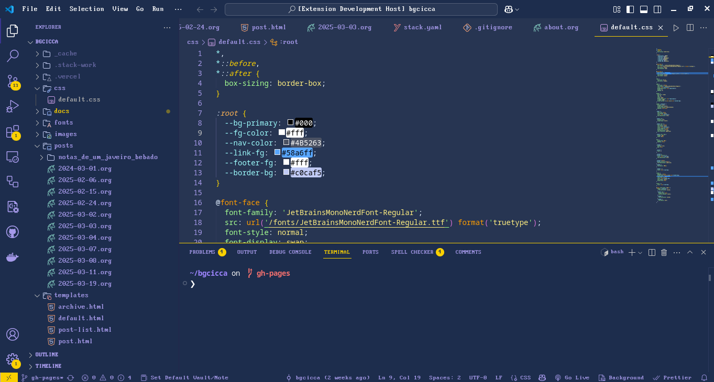

# shades-of-sky 

🦄 Shades of Sky offers a hand-picked selection of bold and calm shades of Sky that will transform your code into a visually stunning masterpiece. With its carefully crafted color palette, this theme brings a sense of style, elegance, and whimsy to your favorite code editor, making your coding sessions a delightful journey of creativity. 

 

## 🎨 Color palette

|      USAGE       |                                HEX CODES                                 |
| ---------------- | ------------------------------------------------------------------------ |
| Background       |  `#273552`       |
| Foreground       |  `#A599E9`       |
| Hover Background |  `#4D21FC`       |
| Contrast         |  `#FAD000`       |
| Contrast Lite    |  `#FFEE80`       |
| Contrast Lite II |  `#FAEFA5`       |
| Highlight        |  `#FF7200`       |
| Comment          |  `#B362FF`       |
| Constants        |  `#FF628C`       |
| Keywords         |  `#FF9D00`       |
| Other            |  `#9EFFFF`       |
| Strings          |  `#A5FF90`       |
| Templates        |  `#3AD900`       |
| Definitions      |  `#FB94FF`       |
| Invalid          |  `#EC3A37F5` |
| Diff Added       |  `#00FF009A` |
| Diff Removed     |  `#FF000D81` |

## 👏 Acknowledgement

[Shades Of Purple](https://github.com/ahmadawais/shades-of-purple-vscode)